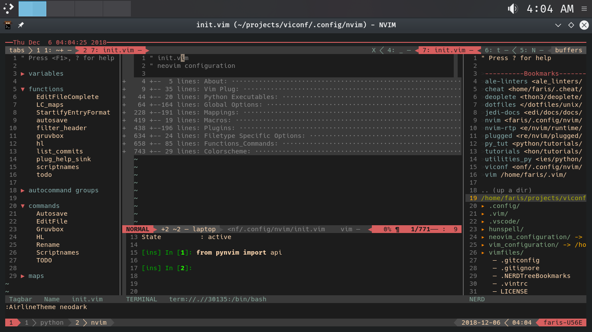

# README

While still a work-in-progress, this repository houses a collection of
initialization files I use to run Neovim and Vim on Linux, Windows 10, and
[Termux](https://www.github.com/termux/termuxapp) on Android.

Neovim is my primary text editor and as a result, I've attempted integrating it
into as much of my workflow as possible.

As a result of personal modifications, this setup currently has:

- Real time interactive displays for reStructured Text files.
- Improved syntax highlighting for man pages over the defaults provided by
  either neovim or vim.
- Automatic autocompletion for any filetype Vim supports via [Deoplete](https://www.github.com/Shougo/deoplete.nvim)
- Snippet integration/expansion for 24 different filetypes. Well over 1000
  snippets are included.
  - Vim's python integration is utilized to expand some snippets. Over 20
    functions are imported and used throughout the varying snippet files.
- Git integration with aliases via Tim Pope's plugin [Fugitive](https://www.github.com/tpope/vim-fugitive)
- Lightly configured embedded terminal. 20+ convenience mappings are provided
  to ease navigation between vim windows.
- Seamless tmux integration.
  - Keybindings for both vim and tmux correspond so that jumping from one
  Vim window to another Tmux pane uses the same keys.
  - The configuration for tmux is displayed at [dotfiles](https://www.github.com/farisachugthai/dotfiles)
  - The statuslines not only correspond, but they're synchronized so that when
  one changes, the other does so as to match.
- Asynchronous linters that are configured in my [dotfiles](https://www.github.com/farisachugthai/dotfiles)
  - Supports flake8, pydocstyle, the python-language-server and others
- Syntax highlighting for files from [Zim
  wiki](https://github.com/jaap-karssenberg/zim-desktop-wiki)
- Spell-checking with dictionaries that have been personally compiled
  and reviewed
- Multiple colorschemes that support xterm-256 or 24 bit terminals.

**Disclaimer**

Approximately half of the snippets were not authored by me.
That credit goes to[honza](https://www.github.com/honza)
in his [vim-snippets](https://www.github.com/honza/vim-snippets) repository

## Usage

*TODO: Wrap keycodes with <kbd></kbd>. Either make a macro or a postfix
snippet?*

### Basics Keymappings

| Keycode | Mode  | [Command]Description                              |
| :---:   | :---: | :---                                              |
| h       | Norm     | Move cursor one char left                      |
| j       | Norm     | Move cursor one char down                      |
| k       | Norm     | Move cursor one char up                        |
| l       | Norm     | Move cursor one char right                     |
| w       | Norm     | Move cursor to the beginning of the next word  |
| b       | Norm     | Move cursor to the beginning of the prev word  |
| M       | Norm     | Move cursor to vertical center                 |
| gg      | Norm     | Move to the first line                         |
| G       | Norm     | Move to the last line                          |
| :w      | Cmd      | Save the current buffer                        |
| :q      | Cmd      |                                                |

### Remappings

TODO

Further explanations for how nvim is configured can be found in the
 [Neovim README](./.config/nvim/README.rst).

## Plugins Used

Here's a current list of all my plugins, a summary of their usage, and notes
on my personal customizations.

- [vim-plug](https://www.github.com/junegunn/vim-plug)
- [FZF](https://www.github.com/junegunn/fzf)
- [FZF.vim](https://www.github.com/junegunn/fzf.vim)

### NERDTree

- [NERDTree](https://www.github.com/scrooloose/nerdTree)

NERDTree is a file explorer plugin that provides "project drawer"
functionality to your vim editing.  You can learn more about it with
`:help NERDTree`.

#### QuickStart

Launch using `<Leader>nt`.

- [Jedi-Vim](https://www.github.com/davidhalter/jedi-vim)
- [Git-Gutter](https://www.github.com/airblade/vim-gitgutter)
- [Fugitive](https://www.github.com/tpope/vim-fugitive)
- [Vim-Commentary - tpope](https://www.github.com/tpope/vim-commentary)
- [ALE, the Asynchronous Lint Engine](https://www.github.com/w0rp/ale)
- [Vim-Tmux-Navigator](https://www.github.com/christoomey/vim-tmux-navigator)
- [LanguageClient](https://www.github.com/autozimu/LanguageClient-neovim)
- [UltiSnips](https://www.github.com/SirVer/ultisnips)
- [Airline](https://www.github.com/vim-airline/vim-airline)
- [Tmuxline](https://www.github.com/edkolev/tmuxline.vim)
- [Startify](https://www.github.com/mhinz/vim-startify)
- [Deoplete](https://www.github.com/Shougo/deoplete.nvim)
- [Deoplete-jedi](https://www.github.com/zchee/deoplete-jedi)
- [Tagbar](https://www.github.com/majutsushi/tagbar)
- [Tabular](https://www.github.com/godlygeek/tabular)
- [Voom](https://www.github.com/vim-voom/voom)
- [Devicons](https://www.github.com/ryanoasis/vim-devicons)

## License

This project is licensed under the MIT License.

## Acknowledgments

- [vim](https://www.github.com/vim/vim)
- [Neovim](https://www.github.com/neovim/neovim)

I want to individually thank @tpope and @junegunn for their Fugitive and FZF
plugins respectively. Largely because reading through the source code for
those projects helped kick off my excitement in
tweaking and optimizing my workflow.

Drew Neil's Vimcasts is a perpetual source of information for me as is his
book Practical Vim.

Derek Wyatt's videos also deserve some praise here.

Steve Losh's Learn VimScript the Hard Way is a book I recently picked up, and
would highly recommend!
